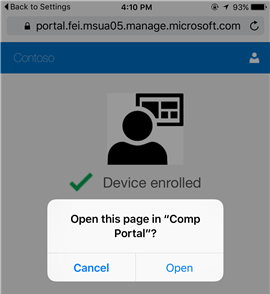

# Регистрация устройства iOS в Intune

Если в вашей компании или учебном заведении используется Microsoft Intune, вы можете зарегистрировать устройство iOS, чтобы получить доступ к электронной почте, файлам и другим ресурсам организации. Регистрация устройств позволяет ИТ-отделу управлять рабочими или учебными ресурсами и обеспечивать их безопасность, предоставляя вам свободу выбора устройств для выполнения рабочих задач. Дополнительные сведения о регистрации см. в разделе [Что произойдет, если установить приложение корпоративного портала и зарегистрировать устройство в Intune](what-happens-if-you-install-the-company-portal-app-and-enroll-your-device-in-intune-ios.md).

<iframe src="https://channel9.msdn.com/Series/IntuneEnrollment/iOS-Enrollment/player" width="960" height="540" allowFullScreen frameBorder="0"></iframe>

> [!NOTE]
> Если вы хотите зарегистрировать устройство под управлением macOS, например MacBook Pro или iMac, [используйте эти инструкции](enroll-your-device-in-intune-macos.md).

**Перед началом работы:**

- Обязательно пройдите регистрацию до конца после начала этих действий. Приостановка более чем на несколько минут обычно полностью останавливает процесс, и его нужно будет перезапустить.
- Если регистрация по какой-либо причине завершится ошибкой, вернитесь в приложение корпоративного портала и повторите попытку.
- Убедитесь, что включена поддержка Wi-Fi. В противном случае провести регистрацию не удастся.
- Если на устройстве заблокирован браузер Safari, разблокируйте его. Для регистрации необходимо использовать браузер Safari.

**Чтобы зарегистрировать устройство iOS, выполните указанные ниже действия.**

1.  Выполните инструкции, приведенные в разделе [Установка приложения корпоративного портала Intune и вход в него](install-and-sign-in-to-the-intune-company-portal-app-ios.md).

2. На странице **Настройка доступа к ресурсам организации** нажмите **Начать**.

    

3. На экране **Зачем регистрировать устройство?** ознакомьтесь с возможностями, которые доступны при регистрации устройства, а затем выберите **Продолжить**.

    

> [!NOTE]
> Желтые треугольники не означают, что уже произошла ошибка. Эти значки указывают, что еще остаются действия, которые необходимо выполнить в процессе регистрации.

4. Ознакомьтесь со списком того, что именно ИТ-администратор может просматривать на вашем зарегистрированном устройстве, и нажмите **Продолжить**.

    

5.  На экране **Дальнейшие действия** ознакомьтесь с тем, что происходит во время регистрации, а затем нажмите **Зарегистрировать**.

     

6.  На экране **Установить профиль** выберите **Установить** и введите секретный код при появлении соответствующего запроса.

    

7.  Нажмите **Установить**.

        

8.  Нажмите **Установить**, чтобы указать, что вы прочитали предупреждение.

       

9.  Нажмите **Доверие**.

       

10.  После окончания установки профиля нажмите **Готово**.

     

    На экране появится сообщение "Регистрация устройства".

11.  Когда появится сообщение с вопросом, хотите ли вы открыть страницу на корпоративном портале, нажмите **Открыть**.

    

12. На экране **Настройка доступа к ресурсам организации** нажмите **Продолжить**. Если ваш ИТ-администратор установил дополнительные требования к безопасности, например, необходимость установки пароля, следуйте инструкциям на экране, пока не будут выполнены все требования и вы не вернетесь на экран "Настройка доступа к ресурсам организации", после чего нажмите **Продолжить**.

    

13. Нажмите **Готово**.

    

Теперь ваше устройство зарегистрировано в Intune и вы вернулись в приложение корпоративного портала.

> [!Note]
> Если в вашей организации используется программное обеспечение для управления затратами на телекоммуникации, для полной регистрации устройства потребуется выполнить дополнительные действия. Дополнительные сведения см. [здесь](enroll-your-device-with-telecom-expense-management-ios.md).

По-прежнему нужна помощь? Обратитесь к ИТ-администратору. Его контактные данные доступны на [веб-сайте корпоративного портала](http://portal.manage.microsoft.com).

