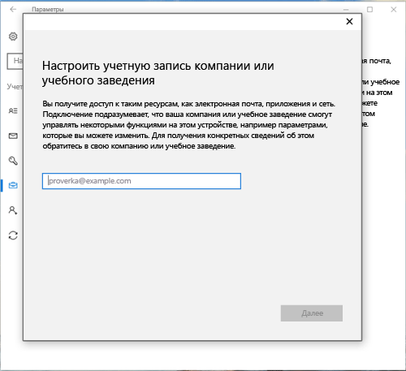
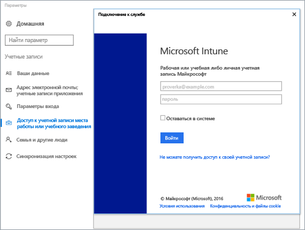
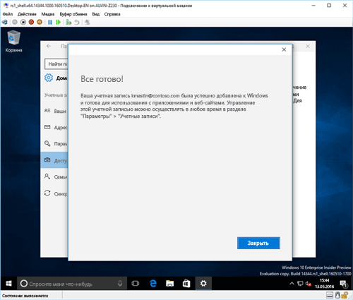

# Регистрация устройства на базе Windows 10 в Intune

> [!NOTE]
> Windows 10 работает на устройствах всех типов. Независимо от того, используете ли вы компьютер, телефон или планшет, действия, которые нужно выполнить, одинаковы — даже если они немного отличаются от изображений, приведенных на этой странице.

> [!VIDEO https://channel9.msdn.com/Series/IntuneEnrollment/Windows-Enrollment/player]

1. Перейдите в меню **Пуск**.

   - Для устройств с **Windows 10 Desktop** перейдите в **меню Пуск**.
   - Для устройств с **Windows 10 Mobile** перейдите к **начальному экрану**, затем проведите, чтобы открыть список **Все приложения**.

2. Откройте приложение **Параметры** в Windows, набрав "параметры" в строке поиска.

3. Выберите пункты **Учетные записи** > **Доступ к рабочей или учебной учетной записи** > **Подключить**.

    

4. Введите рабочий или учебный адрес электронной почты и нажмите кнопку **Далее**.

   

5. Выполните вход в Intune через рабочую или учебную учетную запись.

    

    Появится сообщение о том, что устройство регистрируется в вашей компании или учебном заведении.

6. При появлении страницы **Всё готово!** нажмите кнопку **Закрыть**. Все готово.

   

7. Если вы хотите еще раз убедиться, что подключение установлено правильно, вернитесь в раздел **Параметры**. Ваша рабочая или учебная учетная запись должна появиться в списке.

    

Если вы выполнили описанные выше действия, но по-прежнему не можете получить доступ к рабочей или учебной учетной записи электронной почты и файлам, выполните инструкции из раздела [Устранение неполадок при появлении элемента "Доступ к учетной записи места работы или учебного заведения"](troubleshoot-your-windows-10-device-windows.md#troubleshooting-steps-to-follow-if-you-see-access-work-or-school).
