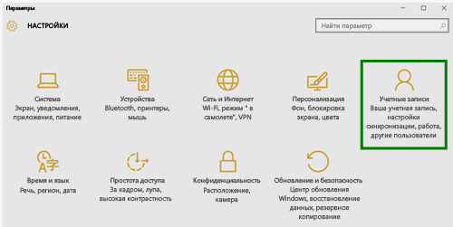
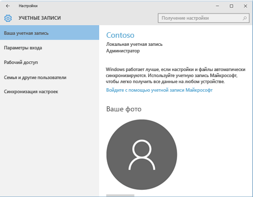
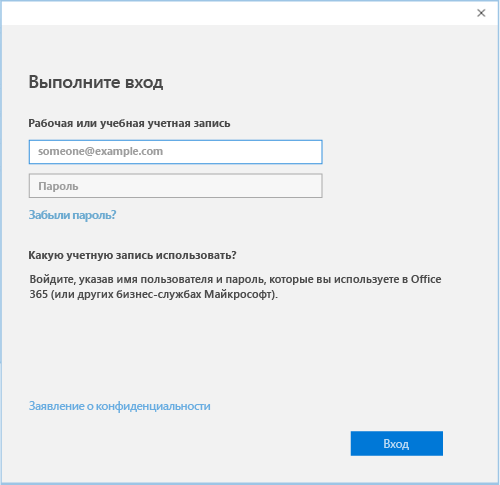

# Регистрация устройства на базе Windows 10 в Intune

  > [!NOTE]
  > Windows 10 работает на устройствах всех типов. Независимо от того, используете ли вы компьютер, телефон или планшет, действия, которые нужно выполнить, одинаковы — даже если они немного отличаются от изображений, приведенных на этой странице.

1.  Перейдите в меню **Пуск**.

  - Для устройств с **Windows 10 Desktop** перейдите в **меню Пуск**.
  - Для устройств с **Windows 10 Mobile** перейдите к **начальному экрану**, затем проведите, чтобы открыть список **Все приложения**.

2. Откройте приложение **Параметры** в Windows, набрав "параметры" в строке поиска.

3. Выберите **Учетные записи**.

    

4. Выберите пункт **Моя учетная запись**.

    

5. Выберите команду **Добавить рабочую или учебную учетную запись**.

    

6. Войдите, используя рабочую или учебную учетную запись.

    

По-прежнему не удается получить доступ к рабочей или учебной электронной почте, файлам или другим данным? Попробуйте восстановить доступ, [устранив неполадки со своей учетной записью](troubleshoot-your-windows-10-device-windows.md#troubleshooting-steps-to-follow-if-you-see-your-account). Если это не помогает, обратитесь за помощью в службу поддержки вашей компании.

Чтобы без затруднений получить помощь от службы поддержки вашей компании, используйте контактные данные, доступные в приложении "Корпоративный портал", где также можно найти и скачать рекомендуемые и обязательные приложения для повседневной работы. Возможно, приложение корпоративного портала уже установлено на вашем устройстве. Чтобы быстро проверить его наличие, найдите __Корпоративный портал__ в списке __Все приложения__.

Если вы не видите корпоративный портал в списке приложений, выполните следующие действия для его установки.

1. Выберите пункты **Пуск** > **Магазин**.

2. Выберите **Поиск** и введите **корпоративный портал**.

3. В списке результатов выберите пункты **Корпоративный портал** > **Установить**.

4. Нажмите кнопку **Установить** или **Бесплатно**. Для вас разницы между двумя этими вариантами нет. Показанный выбор зависит от настройки приложения корпоративного портала в вашей организации.
