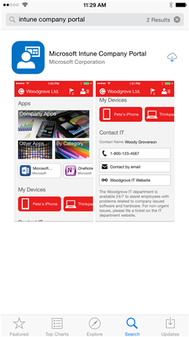

# Установка приложения корпоративного портала и вход в него

Корпоративный портал — это приложение, устанавливаемое на устройстве iOS, чтобы предоставить вам доступ к приложениям, электронной почте и сети компании или учебного заведения.  Прежде чем вы можете получить доступ, необходимо установить приложение корпоративного портала и использовать его для регистрации устройства в Microsoft Intune. Дополнительные сведения см. в разделе [What happens if you install the Company Portal app and enroll your device in Intune?](what-happens-if-you-install-the-company-portal-app-and-enroll-your-device-in-intune-ios.md) (Что произойдет, если установить приложение "Корпоративный портал" и зарегистрировать устройство в Intune?).

1.  Откройте **Магазин приложений** и используйте поиск по словам **корпоративный портал intune**.

2.  Скачайте приложение **корпоративного портала Microsoft Intune**.

    

3.  Откройте приложение корпоративного портала, введите рабочий или учебный адрес и пароль и нажмите **Войти**.

    Если вы вошли в приложение корпоративного портала первый раз и ваша организация или учебное заведение используют Intune, вам будет предложено зарегистрировать устройство в Intune. Чтобы зарегистрироваться, выполните действия, описанные в статье [Регистрация устройства iOS в Intune](enroll-your-device-in-intune-ios.md). Вы также можете [войти с помощью другого устройства](https://docs.microsoft.com/intune-user-help/sign-in-to-the-company-portal#signing-in-from-another-device).

По-прежнему нужна помощь? Обратитесь в службу поддержки вашей компании. Его контактные данные доступны на [веб-сайте корпоративного портала](https://portal.manage.microsoft.com).
