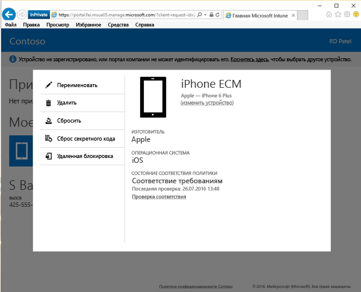

# удалять устройство с корпоративного портала;

Если вы решили, что устройство больше не должно управляться вашей организацией, его можно удалить на [веб-сайте корпоративного портала](https://go.microsoft.com/fwlink/?linkid=2010980). После удаления устройство больше не отображается на корпоративном портале. Кроме того, вы можете потерять доступ к данным, приложениям и электронной почте вашей организации.

Удаление устройства

1. На [веб-сайте корпоративного портала](https://go.microsoft.com/fwlink/?linkid=2010980) нажмите кнопку __меню__ , а затем выберите __Мои устройства__.

   

2. На странице __Мои устройства__ выберите устройство, которое требуется удалить.

    

3. Появится всплывающее окно со сведениями об устройстве. Нажмите кнопку **Удалить**.

   

4. Прочтите предупреждающее сообщение, а затем нажмите **Удалить**, чтобы удалить устройство с корпоративного портала.

По-прежнему нужна помощь? Обратитесь в службу поддержки вашей компании. Его контактные данные доступны на [веб-сайте корпоративного портала](https://go.microsoft.com/fwlink/?linkid=2010980).
