# Синхронизация устройства с Windows вручную.

Если скорость установки приложения не соответствует ожиданиям, настройте синхронизацию устройства вручную. Если синхронизация настроена вручную, устройство подключается к Intune для получения последних обновлений и сообщений. Когда синхронизация устройства будет завершена, скорость установки может повыситься.

Intune поддерживает синхронизацию вручную с помощью приложения "Корпоративный портал" и приложения параметров устройств. 

Функции приложения "Корпоративный портал" поддерживаются для устройств под управлением Windows 10 Creators Update (1703) или более поздней версии. 
* [Синхронизация с помощью приложения "Корпоративный портал"](#Sync-from-Company-Portal-app-for-Windows)  

Все устройства Windows можно синхронизировать с помощью приложения параметров устройств, включая:

* [Windows 10 Desktop](#windows-10-desktop)  
* [Microsoft HoloLens](#microsoft-hololens);   
* [Windows 10 Mobile](#windows-10-mobile)  
* [Windows Phone 8.1](#windows-phone-81)    

## Синхронизация из приложения корпоративного портала для Windows
Чтобы вручную настроить синхронизацию любого устройства под управлением Windows 10 Creators Update (1703) или более поздней версии, сделайте следующее.

1.  Откройте приложение "Корпоративный портал" на устройстве.

2.  Последовательно выберите **Параметры** > **Синхронизации**.

      
    
      

## Синхронизация с помощью приложения "Параметры" 
Чтобы вручную настроить синхронизацию устройств под управлением Microsoft HoloLens, Windows 10 Desktop, Windows 10 Mobile или Windows Phone 8.1 с помощью приложения "Параметры", сделайте следующее.

### Windows 10 Desktop
1. На своем устройстве последовательно выберите **Пуск** > **Параметры**.

2. Выберите **Учетные записи**.

    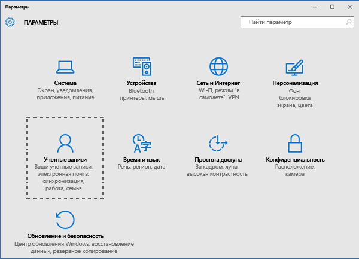  

3. Есть несколько классических версий Windows 10. Сравните изображение на экране своего устройства с представленными ниже снимками экрана, чтобы определить, какой набор инструкций нужно выполнить. 

    * Если на экране отображается параметр **Доступ к рабочей или учебной учетной записи**, перейдите к инструкциям для параметра [Доступ к рабочей или учебной учетной записи](#access-work-or-school).

      

    * Если на экране отображается параметр **Рабочий доступ**, перейдите к инструкциям для параметра [рабочего доступа](#work-access).  

    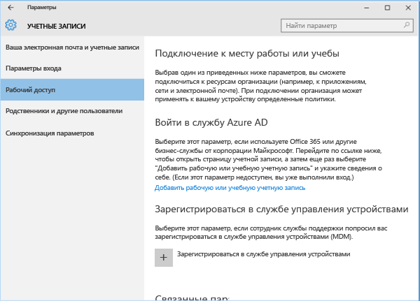

#### Инструкции для параметра доступа к рабочей или учебной учетной записи

1. Выберите **Доступ к рабочей или учебной учетной записи**.

      

2. Выберите учетную запись, рядом с которой отображается значок портфеля. Если эта учетная запись не отображается, возможно, в вашей компании заданы другие настройки. В таком случае щелкните учетную запись, рядом с которой отображается логотип корпорации Майкрософт.

     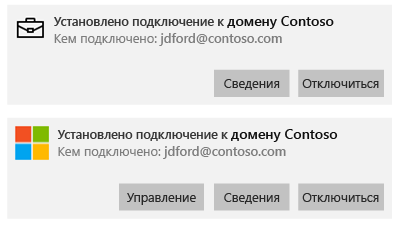

3. Щелкните **Информация**. 

4. Щелкните **Синхронизировать**. 

#### Инструкции для параметра рабочего доступа

1.  Щелкните **Рабочий доступ**.

    

2. В разделе **Регистрация в системе управления устройствами** выберите название своей организации.

    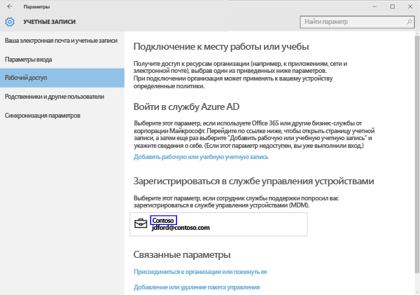

3. Щелкните **Синхронизировать**. Кнопка останется неактивной до завершения синхронизации.

    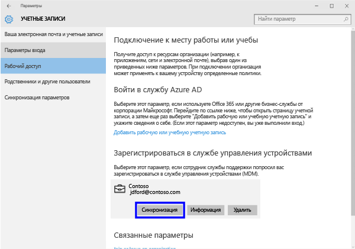  

### Windows 10 Mobile

   1. На своем устройстве последовательно выберите пункты **Все приложения** > **Параметры** > **Учетные записи**.

       

   2. Выберите **Рабочий доступ**.

       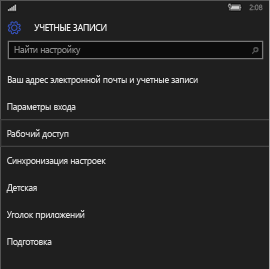

   3. В разделе **Регистрация в системе управления устройствами** выберите название своей организации.

       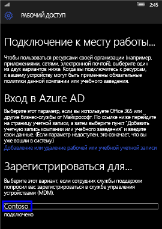

   4. Щелкните значок **синхронизации**. Кнопка останется неактивной до завершения синхронизации.

       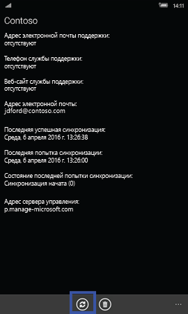  
### Microsoft HoloLens  
Эти инструкции относятся к устройствам HoloLens под управлением юбилейного обновления Windows 10 (также называется RS1). 
1.  Откройте на устройстве приложение "Параметры".  

2.  Последовательно выберите **Учетные записи** > **Рабочий доступ**.  
      

3.  Выберите свою подключенную учетную запись и нажмите кнопку **Синхронизировать**.   

### Windows Phone 8.1

1. Последовательно выберите пункты **Все приложения** > **Параметры** > **Рабочая область**.

    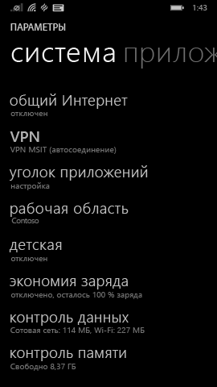

2. Выберите название своей компании.

    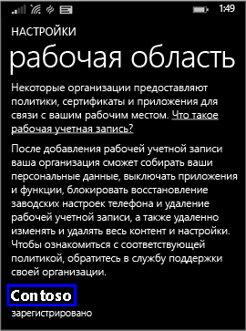

3. Щелкните значок **синхронизации**.

    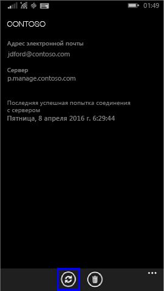

По-прежнему нужна помощь? Обратитесь в службу поддержки вашей компании. Его контактные данные доступны на [веб-сайте корпоративного портала](https://portal.manage.microsoft.com#HelpDeskDialog).
