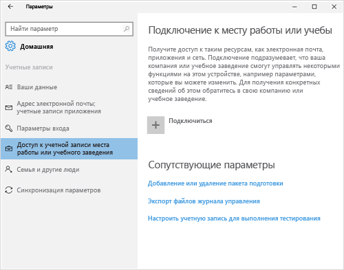
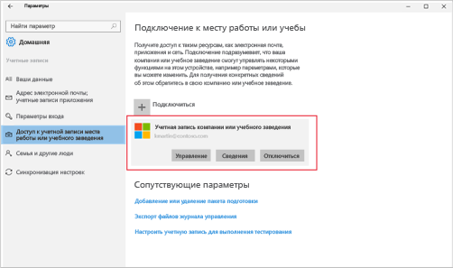

# Устранение проблем при регистрации устройств c Windows 10
Если вы выполнили инструкции из статьи [Регистрация устройства с ОС Windows 10 Mobile или Windows 10 Desktop в Intune](enroll-your-w10-phone-or-w10-pc-windows.md), но по-прежнему не можете получить доступ к своей рабочей или учебной электронной почте и файлам, попробуйте выполнить следующие действия по устранению неполадок.

1.  Посмотрите на следующие два снимка экрана и выберите тот, который похож на экран вашего устройства. Выполните действия, показанные на выбранном экране.

    Если вы видите этот экран, следуйте инструкциям из раздела [Устранение неполадок при появлении элемента "Доступ к учетной записи места работы или учебного заведения"](#troubleshooting-steps-to-follow-if-you-see-access-work-or-school).

    

    Если вы видите этот экран, следуйте инструкциям из раздела [Устранение неполадок при появлении элемента "Ваша учетная запись"](#troubleshooting-steps-to-follow-if-you-see-your-account).

    

## Устранение неполадок при появлении элемента "Доступ к учетной записи места работы или учебного заведения"

1.  Если вы выполнили описанные выше действия, но по-прежнему не можете получить доступ к рабочей или учебной электронной почте и файлам, вернитесь в раздел **Доступ к учетной записи места работы или учебного заведения**.

2. Выполните одно из следующих действий.

    - При появлении подключения, которое выглядит примерно как на рисунке ниже, выберите его и убедитесь, что отображаются кнопки "Управление", "Информация" и "Отключить". Если эти команды отображаются, вы выполнили регистрацию и подключение.

    

    - Если сведения о подключении, описанные выше, не отображаются или отображаются не все команды, выберите **Подключить** и войдите со своими рабочими или учебными учетными данными. После этого подключение должно быть установлено.

## Устранение неполадок при появлении элемента "Ваша учетная запись"

Если вы выполнили описанные выше действия, но по-прежнему не можете получить доступ к рабочей или учебной электронной почте, файлам и другим данным, вернитесь в раздел **Учетные записи** и выберите **Рабочий доступ**.

- Если вы видите рабочую или учебную учетную запись, поздравляем, вы подключены.

- Если вы не видите рабочую или учебную учетную запись, нажмите **Подключиться**, а затем войдите с помощью рабочей или учебной учетной записи.

По-прежнему нужна помощь? Обратитесь к ИТ-администратору. Его контактные данные доступны на [веб-сайте корпоративного портала](http://portal.manage.microsoft.com).
