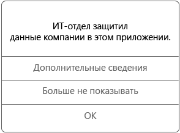

# Использование управляемых приложений на устройстве Android

Управляемые приложения — это приложения, которые служба поддержки вашей компании может настроить для защиты данных организации, доступных в таком приложении. При доступе к данным организации в управляемом приложении на устройстве Android вы можете заметить, что работа приложения немного отличается от ожидаемой. Например, может отсутствовать возможность скопировать и вставить защищенные данные организации или сохранить данные в определенных расположениях.

На устройстве могут совместно работать различные управляемые приложения, позволяя вам выполнять повседневные задачи и обеспечивая защиту корпоративных данных. Например, если вы откроете в одном управляемом приложении файл организации, для просмотра которого необходимо другое управляемое приложение, соответствующее приложение открывается автоматически. Если нужное приложение отсутствует, определенные действия, такие как открытие документа или переход по веб-ссылке из управляемого документа, могут оказаться недоступными.

При доступе к данным организации в управляемом приложении появляется сообщение (например, подобное приведенному ниже) о том, что открываемое приложение является управляемым.

## Как получить управляемые приложения?
Управляемые приложения можно получить двумя способами.

-   При регистрации устройства в Microsoft Intune либо вы устанавливаете приложение из приложения или с веб-сайта корпоративного портала, либо служба поддержки вашей компании может установить его на вашем устройстве. Дополнительные сведения о регистрации см. в статье [Enroll your device in Intune](enroll-your-device-in-Intune-android.md) (Регистрация устройства в Intune).

-   Вы устанавливаете приложение из Магазина Google Play и затем выполняете вход под корпоративной учетной записью, которая управляется Intune.

## Чем служба поддержки моей компании может управлять в приложении?
Ниже приведено несколько примеров параметров, которые затрагивают ваше взаимодействие с данными организации на устройстве и могут управляться службой поддержки вашей компании в приложении.

-   Доступ для определенных веб-сайтов

-   Передача данных между приложениями

-   Сохранение файлов

-   Операции копирования и вставки

-   Требования к ПИН-код доступа

-   Вход с использованием учетных данных организации

-   Возможность резервного копирования в облако

-   Возможность создания снимков экрана

-   Требования к шифрованию данных

Некоторые распространенные приложения, которыми может управлять ваш ИТ-отдел:

-   Управляемый браузер Intune

-   Intune Image Viewer

-   Intune PDF Viewer

-   Intune AV Player

-   Microsoft Word, Excel и PowerPoint

Для получения дополнительных сведений об управляемых приложениях на устройстве обратитесь в службу поддержки вашей компании. Его контактные данные доступны на [веб-сайте корпоративного портала](https://portal.manage.microsoft.com).
