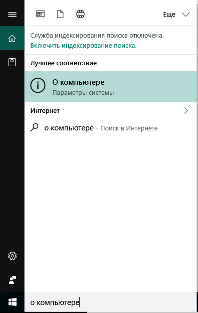
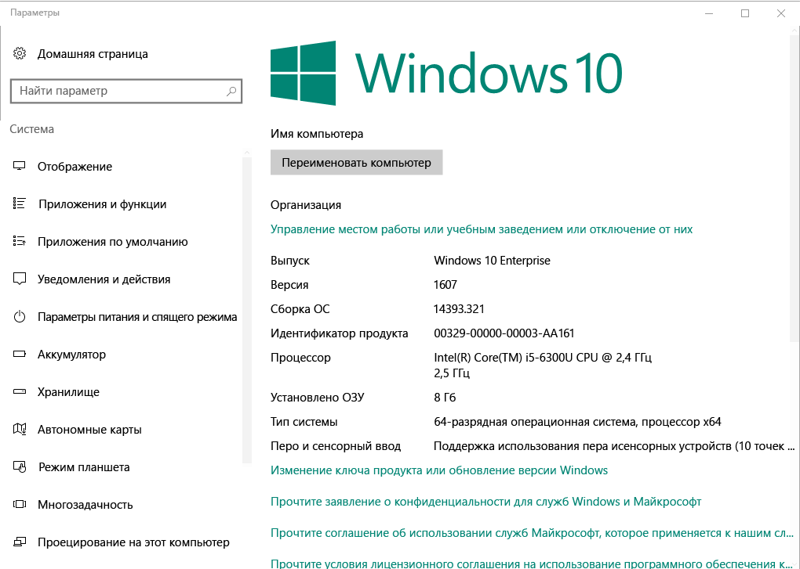

# Регистрация устройства Windows в корпоративный портал Intune  

Регистрация устройства Windows в приложение корпоративного портала Intune, чтобы получить безопасный доступ для рабочей и учебной приложений, сообщений электронной почты и файлам. Если ваша организация требует или рекомендует определенные приложения, например Office или OneDrive, вы либо получите их во время регистрации, или они будут доступны в приложении корпоративного портала после регистрации.  

Вы можете зарегистрировать устройства Windows 10 через веб-сайт корпоративного портала *или* приложения. Если при регистрации устройства с помощью более ранней версии Windows, необходимо зарегистрировать устройство с помощью веб-сайт корпоративного портала.  

## Приложение установки корпоративного портала  
Возможно, уже установлено на вашем устройстве приложение корпоративного портала. Поиск приложения в вашей __все приложения__ списка.  Если вы не видите корпоративный портал в списке приложений, выполните следующие действия для его установки.  

1. Откройте **Microsoft Store** на вашем устройстве.

2. В **поиска** введите **корпоративного портала**.

3. В списке результатов выберите пункты **Корпоративный портал** > **Установить**.

4. Нажмите кнопку **Установить** или **Бесплатно**. Нет никакой разницы между двумя этими вариантами; слова открывалась по настройке приложения вашей организации.  

## Найти номер версии Windows 10  
Инструкции по регистрации отличаются для разных версий Windows 10 устройств. Следующие шаги описывают, как найти номер версии в Windows 10 для настольных и мобильных устройств. После вы знаете вашей версии, продолжите шаги рекомендуемые регистрации.  

### Устройства с Windows 10 Desktop  

1. Перейдите в меню **Пуск**.

2. В поле поиска введите фразу «о Компьютере.» Выберите __о Компьютере__ в результатах.  

     

3. Прокрутите вниз до раздела **спецификации Windows** найти **версии** Windows 10, установленными на вашем Компьютере.  

     

4. Если ваша версия —  

    *  __1607 или более поздней__: регистрация устройства посредством [ **параметры** > **учетной записи** > **доступ к рабочей или учебной**маршрута](enroll-windows-10-device.md#enroll-windows-10-version-1607-and-later-device).   
    * __1511 или более ранней версии__: регистрация устройства посредством [ **параметры** > **учетной записи** > **учетные записи** маршрут](enroll-windows-10-device.md#enroll-windows-10-version-1511-and-earlier-device).  

### Устройства Windows 10 Mobile       

1.  Перейдите к __все приложения__ и выберите __параметры__ приложения.  
2.  Выберите __Система__ > __О системе__.      
3.  В разделе __сведений об устройстве__, найти __версии__.  
4. Если ваша версия —  

    *  __1607 или более поздней__: регистрация устройства с помощью [ **параметры** > **доступ к рабочей или учебной** маршрута](enroll-windows-10-device.md#enroll-windows-10-version-1607-and-later-device).   
    * __1511 или более ранней версии__: регистрация устройства с помощью [ **параметры** > **учетные записи** маршрута](enroll-windows-10-device.md#enroll-windows-10-version-1511-and-earlier-device).  

## Регистрация устройств, отличных от Windows 10  
Зарегистрировать остальные поддерживаемые устройства Windows через веб-сайт корпоративного портала с использованием следующих статьях:   
* [Устройство с Windows 8.1 или Windows RT 8.1](enroll-your-W81-or-rt81-windows.md)  
* [Устройство Windows Phone 8.1](enroll-your-wp81-windows.md)    

## Дальнейшие шаги  
Теперь, когда вы знаете, поддерживаемые устройства и номер версии Windows 10, перейдите к статье рекомендуемые регистрации.  
 
Дополнительные сведения об управлении устройствами корпоративного портала, а также как оба используются в школах и на работе, см. в следующих статьях:  
* [Использование управляемых устройств для доступа к рабочим или учебным ресурсам](use-managed-devices-to-get-work-done.md)  
* [Что произойдет, если установить приложение корпоративного портала и зарегистрировать устройство iOS или Mac OS X в Intune?](what-happens-if-you-install-the-company-portal-app-and-enroll-your-device-in-intune-windows.md)  
* [Какие сведения становятся доступными для моей организации при регистрации устройства?](what-info-can-your-company-see-when-you-enroll-your-device-in-intune.md)  

Требуется помощь? Обратитесь в службу поддержки вашей компании. [Перейдите на веб-сайт корпоративного портала](https://go.microsoft.com/fwlink/?linkid=2010980) для поиска организации ИТ контактные данные.  
