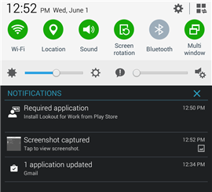

# Вам необходимо установить Lookout for Work

Перед тем как вы сможете получить доступ к рабочим файлам, ИТ-администратору необходимо установить приложение Lookout for Work, которое помогает защитить устройство путем поиска потенциальных угроз безопасности.

Если возникают проблемы с установкой, выполните действия по устранению неполадок, описанные в конце этого раздела.

**Необходимо выполнить следующие действия:**

1.    Перетащите вниз из верхней части экрана панель уведомлений и откройте ее, а затем коснитесь пункта **Необходимые приложения — установить Lookout for Work из Магазина Google Play**.

  

2.    Будет выполнен переход на страницу Lookout for Work в Магазине Google Play. Установите Lookout for Work и коснитесь кнопки **ПРИНЯТЬ**, чтобы разрешить Lookout for Work доступ к устройству.

  

3. Откройте Lookout for Work и коснитесь кнопки **АКТИВИРОВАТЬ**.

  

4. Коснитесь элемента **Sign in with Azure Active Directory** (Вход с использованием Azure Active Directory) и укажите учетную запись, которая используется для доступа к рабочей или учебной электронной почте и файлам.

  

5. Выберите учетную запись, используемую для доступа к рабочей или учебной электронной почте и файлам, и коснитесь кнопки **ДОБАВИТЬ УЧЕТНУЮ ЗАПИСЬ**.

  

6. Коснитесь кнопки **Принять**, чтобы предоставить Lookout for Work разрешение на вход и чтение профиля. Появится окно с сообщением о том, что Lookout for Work подключается к Lookout Security Cloud.

  

7. Ознакомьтесь с материалами о защите устройств с помощью Lookout, а затем коснитесь кнопки **ОK**.

  

  Появление следующего экрана означает, что Lookout установлен и подключен.

  

  Lookout for Work сразу начнет проверять ваше устройство на наличие угроз безопасности. Если угрозы не найдены, появится следующий экран.

  

  Экран сведений об устройстве на корпоративном портале показывает, что вы теперь соответствуете требованиям безопасности вашей организации.

    

  Если Lookout for Work обнаружит на устройстве угрозы безопасности, будут предложены инструкции по устранению проблемы.

**Если установка не выполняется**

Иногда может происходить сбой установки из-за технических проблем, решить которые вы не можете. В этом случае попробуйте установить Lookout for Work [вручную из Магазина Google Play](https://play.google.com/store/apps/details?id=com.lookout.enterprise).

По-прежнему нужна помощь? Обратитесь к ИТ-администратору. Его контактные данные доступны на [веб-сайте корпоративного портала](http://portal.manage.microsoft.com).

